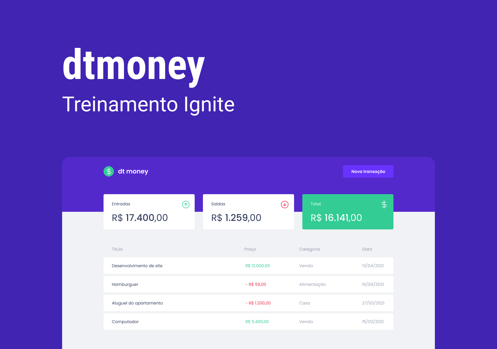

# dtmoney

Application of a finance manager developed in [Rocketseat's](https://www.rocketseat.com.br/) _Ignite ReactJS_ course using ReactJS and TypeScript.



# Getting Started

On terminal, go to the repository directory and execute the following command to install all de dependencies:

```bash
yarn
```

Then, to runs the app in the development mode, execute:

```bash
yarn start
```

Open [http://localhost:3000](http://localhost:3000) to view it in the browser.

The page will reload if you make edits.\
You will also see any lint errors in the console.
